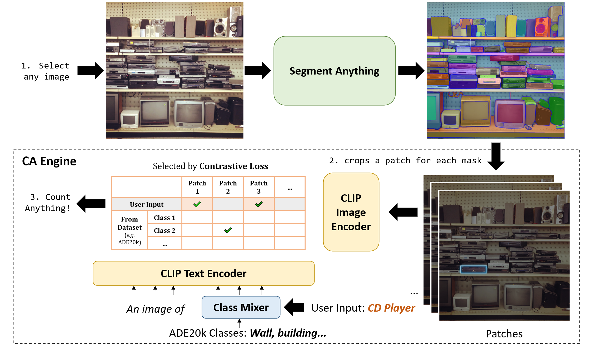
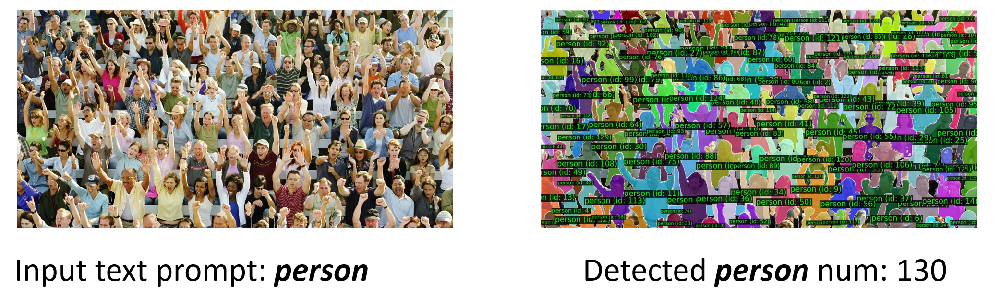

# Count Anything

### [Official repo](https://github.com/ylqi/Count-Anything)
> **[Count Anything](https://github.com/ylqi/Count-Anything)**  
> Liqi, Yan                            
> ZJU-CV, Zhejiang University / Fudan Univerisity

_**C**ount **A**nything (CA)_ project is a versatile image processing tool that combines the capabilities of [Segment Anything](https://segment-anything.com/), [Semantic-Segment-Anything](https://github.com/fudan-zvg/Semantic-Segment-Anything), and [CLIP](https://arxiv.org/abs/2103.00020).
Our solution can count *any object* specified by users within an image.

### 🚐 Count Anything (CA) engine

The CA engine consists of three steps:
- **(I) Segement Anything.** Following [Semantic-Segment-Anything](https://github.com/fudan-zvg/Semantic-Segment-Anything), CA engine crops a patch for each mask predicted by [Segment Anything](https://segment-anything.com/).
- **(II) Class Mixer.** To identify the masks that match the user’s text prompt, we add the text prompt as an additional class into the class list from the close-set datasets (COCO or ADE20K). 
- **(III) CLIP Encoders.** The CA engine uses CLIP image encoder and text encoder to assess if the text prompt is the best option among other classes. If yes, this mask is considered as an instance of the class given by the text prompt, and the count number is incremented by 1.

## 🚩Examples



## 💻 Requirements
- Python 3.7+
- CUDA 11.1+

## 🛠️ Installation
```bash
conda env create -f environment.yaml
conda activate ca-env
```
## 🚀 Quick Start
### 1. Run [Segment Anything](https://segment-anything.com/) to get segmentation jsons for each image:
Please use `--convert-to-rle` to save segmentation results as `.json` files.
```bash
python scripts/amg.py --checkpoint sam_vit_h_4b8939.pth --model-type vit_h --convert-to-rle --input examples/AdobeStock_323574125.jpg --output output --pred-iou-thresh 0.98 --crop-n-layers 0 --crop-nms-thresh 0.3 --box-nms-thresh 0.5 --stability-score-thresh 0.7
```
```bash
python scripts/amg.py --checkpoint sam_vit_h_4b8939.pth --model-type vit_h --convert-to-rle --input examples/crowd_img.jpg --output output --pred-iou-thresh 0 --min-mask-region-area 0  --stability-score-thresh 0.8
```
### 2. Save the `.jpg` and `.json` in our `data/examples` folder:
```none
├── Count-Anything
|   ├── data
|   │   ├── examples
|   │   │   ├── AdobeStock_323574125.jpg
|   │   │   ├── AdobeStock_323574125.json
|   │   │   ├── ...
```

### 3. Run our Count Anything engine with 1 GPU:
Please use `--text_prompt [OBJ]` to specify the customized class for counting.
```bash
python scripts/main.py --out_dir=output --world_size=1 --save_img --text_prompt="shirt" --data_dir=data/examples 
```
```bash
python scripts/main.py --out_dir=output --world_size=1 --save_img --text_prompt="person" --data_dir=data/crowd_examples/ 
```
The result is saved in `output` folder.

## 😄 Acknowledgement
- [Segment Anything](https://segment-anything.com/) provides the SA-1B dataset.
- [HuggingFace](https://huggingface.co/) provides code and pre-trained models.
- [Semantic-Segment-Anything](https://github.com/fudan-zvg/Semantic-Segment-Anything) provides code.
- [CLIP](https://arxiv.org/abs/2103.00020) provide powerful semantic segmentation, image caption and classification models.

## 📜 Citation
If you find this work useful for your research, please cite our github repo:
```bibtex
@misc{yan2023count,
    title = {Count Anything},
    author = {Yan, Liqi},
    howpublished = {\url{https://github.com/ylqi/Count-Anything}},
    year = {2023}
}
```
